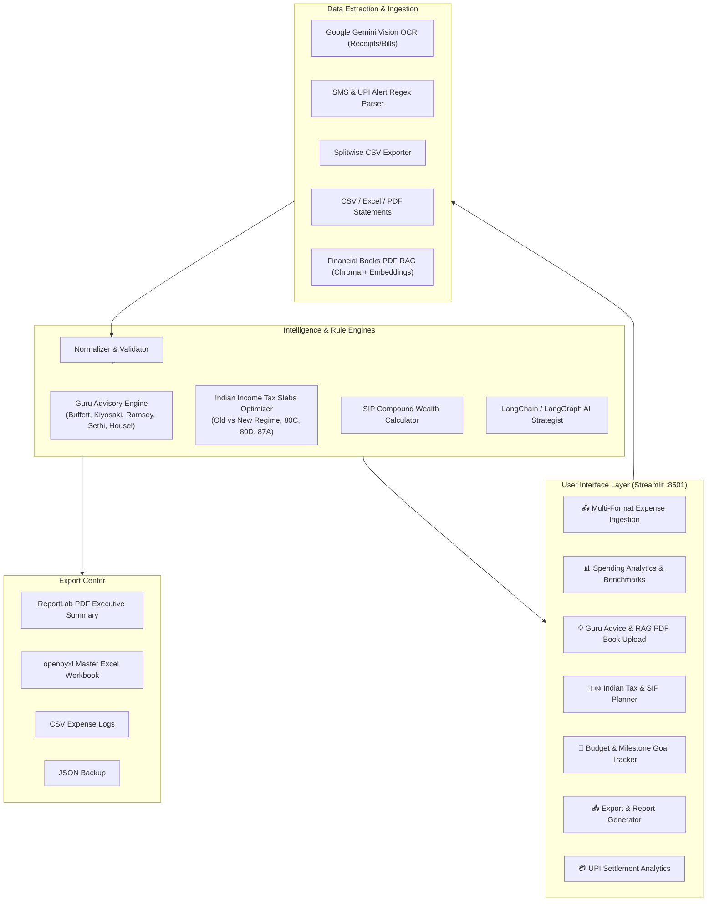

# FinVista AI — Personal Financial Advisor & Enterprise Wealth Intelligence

[](https://python.org)
[](https://streamlit.io)
[](https://langchain.com)
[](https://aistudio.google.com)
[](https://fastapi.tiangolo.com)
[](https://razorpay.com)

**FinVista AI** is a comprehensive, production-ready **Personal Finance Assistant, Wealth Advisor, and Merchant UPI Settlement Tracking Platform**.

It delivers automated expense extraction from payment screenshots and banking SMS alerts, Splitwise group expense synchronization, PDF financial book/article RAG grounding, multi-guru wealth advice (Warren Buffett, Robert Kiyosaki, Ramit Sethi, Dave Ramsey, Morgan Housel, Indian Experts), Indian Tax Slabs optimization (Old vs New Regime, 80C, 80D, NPS), and multi-format report exports.

---

## Core Features & Capabilities

| Feature Area | Capabilities & Highlights | Status |
|---|---|:---:|
| **Expense Hub** | Screenshot OCR receipt extraction, multi-sheet Excel/CSV/JSON ingestion, SMS debit alert parsing, Splitwise group sync | Complete |
| **AI Advisory Engine** | Multi-guru strategy synthesis (Buffett, Ramsey, Sethi, Kiyosaki), RAG document grounding, multi-persona consultation | Complete |
| **Tax & SIP Studio** | Indian Tax Optimizer (Old vs New Regime, 80C, 80D, 80CCD NPS, HRA), SIP compound wealth growth simulator | Complete |
| **UPI Analytics & Exports** | Merchant settlement ledger, Razorpay webhook engine, Bank UTR reconciliation, ReportLab PDF & Excel reports | Complete |

---

## 🏛️ System Architecture



---

## ✨ Key Features & Modules

### 1. 📤 Expense Upload Center & Multi-Format Ingestion
- **Universal Multi-Format Support**:
  - **CSV**: Automatic delimiter detection, column normalization (`date`, `category`, `amount`, `description`).
  - **Excel (`.xlsx`, `.xls`)**: Multi-sheet reading via `openpyxl`.
  - **JSON**: Structured list or nested object parsing.
  - **PDF Statements**: Text extraction from bank statements (SBI, HDFC, ICICI).
  - **Receipt Images (PNG, JPG, JPEG, WEBP)**: Gemini Vision OCR extraction of itemized purchases, taxes, totals, and merchant metadata.
- **Sample Template Downloads**: Built-in 1-click downloads for sample CSV, Excel, and JSON templates.
- **Interactive Manual Entry**: Quick expense form with category picker, date picker, amount, and merchant narration.
- **Dataset Controls**: Append to existing records, replace dataset, or clear all records.

### 2. 📊 Financial Dashboard & Spending Analytics
- **Executive Metric Cards**: Total Monthly Spending, Net Savings / Surplus, Savings Rate %, Average Transaction Size, Top Spending Category & Amount, Total Transaction Count.
- **Interactive Plotly Visualizations**:
  - Donut chart of category distribution with percentage breakdowns.
  - Interactive timeline area chart of daily expense outflows.
- **National Benchmark Comparison**: Benchmarked against the official Indian Household Consumption Expenditure Survey (HCES 2023-24) with variance indicators (`Above Avg`, `Below Avg`, `In Line`).
- **Interactive Expense Explorer**: Real-time keyword search and multi-category filtering grid.

### 3. 💡 Guru Advice & Interactive AI Advisory Hub
- **Automated Guru Insights**:
  - **Warren Buffett**: 50/30/20 principle, never lose money, compounding, low-cost index investing.
  - **Dave Ramsey**: 7 Baby Steps, $1,000 / ₹50,000 starter emergency fund, Debt Snowball, 3–6 month emergency fund calculation.
  - **Ramit Sethi**: Conscious Spending Plan (Fixed Costs 50-60%, Investments 10%, Savings 5-10%, Guilt-Free Spending 20-35%).
  - **Morgan Housel**: Psychology of Money, margin of safety, freedom as the highest dividend.
  - **Benjamin Graham**: Margin of safety, defensive asset allocation, intelligent investor mindset.
- **Multi-Persona Conversational AI**:
  - Switch between *Wealth & Tax Strategist*, *Warren Buffett*, *Dave Ramsey*, and *Ramit Sethi*.
  - Powered by LangChain, LangGraph, and Google Gemini / Groq fast LLMs.

### 4. 🎯 Budget Tracking & Financial Milestone Goals
- **Category Budget Monitor**: Real-time spending progress bars with dynamic status indicators:
  - 🟩 **Safe**: `< 80%` budget consumed.
  - 🟨 **Caution**: `80% - 100%` budget consumed.
  - 🟥 **Over Budget**: `> 100%` with exact deficit amount calculation.
- **Custom Budget Targets**: Inline editing of category budgets.
- **Wealth Milestone Goals**:
  - Track target amounts, current savings, and monthly contribution pace.
  - Automatic time-to-completion projection (months remaining).
  - Form to create new custom savings and milestone goals.

### 5. 📥 Multi-Format Export & Report Generator
- **Executive PDF Report**: Professional multi-page PDF generated via `ReportLab` with executive KPIs, category tables, and Guru guidance.
- **Excel Master Workbook (`.xlsx`)**: Multi-tab spreadsheet with `Transactions`, `Category Breakdown`, `Budget Tracking`, and `Financial Goals`.
- **CSV Expense Log**: Clean CSV download of all records.
- **JSON Data Backup**: Complete structured state backup.

### 6. 💳 UPI Business Settlement Analytics & Sandbox
- **Merchant KPIs**: Total Volume, Net Settled, Pending Settlements, Disputes, PSP Fees, and GST breakdowns.
- **7-Day Settlement Trend Chart**: Visual breakdown of Gross Volume vs. Fees vs. Net Bank Payouts.
- **PSP & App Distribution**: Fee audits across Razorpay, BillDesk, PayU, Google Pay, PhonePe, and Paytm.
- **Bank UTR & Reconciliation Audits**: Automated settlement batch tracking with bank UTR matching and variance flags.
- **Live Simulator**: In-browser UPI payment initiation sandbox and PSP webhook trigger simulator.

---

## 🛠️ Tech Stack & Requirements

| Component | Technology / Library |
|---|---|
| **Frontend UI** | Streamlit 1.59+, Plotly 7.0+, HTML5 / Vanilla CSS |
| **Backend REST API** | FastAPI, Uvicorn, Pydantic v2 |
| **AI / LLM Framework** | LangChain 1.3+, LangGraph 1.2+, Google Gemini 2.5/3.0, Groq |
| **Document Processing** | ReportLab 5.0+ (PDF), openpyxl 3.1+ (Excel), PyPDF |
| **Database & ORM** | SQLite3, SQLAlchemy 2.0+ |
| **Data Science & Math** | Pandas 3.0+, NumPy 2.5+, Matplotlib |

---

## 🚀 Quickstart & Setup Guide

### 1. Prerequisites
- Python 3.10 or higher
- Git
- Google AI Studio API Key ([Get Free Key](https://aistudio.google.com))

### 2. Clone Repository & Setup Virtual Environment
```bash
# Clone the repository
git clone https://github.com/Shiva-bvs/Financial_Advisor_Agent.git
cd Financial_Advisor_Agent

# Create virtual environment
python -m venv .venv

# Activate virtual environment
# Windows (PowerShell):
.\.venv\Scripts\Activate.ps1
# Windows (CMD):
.\.venv\Scripts\activate.bat
# macOS / Linux:
source .venv/bin/activate

# Install dependencies
pip install -r backend/requirements.txt
```

### 3. Configure Environment Variables (`.env`)
Create a `.env` file in the `backend/` directory:
```env
# Required for Vision OCR & Financial AI Agent
GEMINI_API_KEY=your_google_ai_studio_api_key_here

# Optional: Fast LLM acceleration
GROQ_API_KEY=your_groq_api_key_here

# Optional: Financial Market Data APIs
FINNHUB_API_KEY=your_finnhub_key_here
ALPHA_VANTAGE_API_KEY=your_alpha_vantage_key_here
EXCHANGE_RATE_API_KEY=your_exchangerate_key_here

# Optional: Razorpay Payment Gateway Keys
RAZORPAY_KEY_ID=your_razorpay_key_id
RAZORPAY_KEY_SECRET=your_razorpay_key_secret
```

---

## 💻 Running the Applications

### Launch Streamlit Financial Advisory Hub (Primary UI)
```bash
# From the project root directory
streamlit run backend/streamlit_app.py
```
*The app will automatically open at `http://localhost:8501`.*

### Launch FastAPI Backend (REST & Webhook Services)
```bash
# From the project root directory
uvicorn backend.api:app --reload --port 8000
```
*Interactive Swagger API documentation will be available at `http://localhost:8000/docs`.*

---

## 🧪 Testing & Verification

Run the full automated integration test suite:
```bash
python backend/test_integration.py
```

The test suite validates:
1. Database schema and seed transactions.
2. Merchant KPI computations and query filters.
3. Dynamic UPI payment initiation & fee math (MDR + 18% GST).
4. Webhook lifecycle (Authorized $\rightarrow$ Captured $\rightarrow$ Settled with Bank UTR).
5. 7-Day Settlement chart rendering.
6. AI Agent tools (UPI Analytics, Settlement Batches, Compound Interest, Spending Analyzer).
7. FastAPI REST endpoints & Webhook routers.
8. Frontend HTML/CSS integrity.
9. Multi-format parsers (CSV, Excel, JSON, Sample generators).
10. Input validation & financial data sanitization (handling bad rows, future dates, currency symbols).
11. Guru recommendation engine calculations.
12. PDF (`ReportLab`) and Excel (`openpyxl`) export generators.

---

## 📖 API Reference (FastAPI Backend)

| Method | Endpoint | Description |
|---|---|---|
| `GET` | `/api/analytics/transactions` | Query transactions with filters (`merchant`, `status`, `start_date`, `end_date`). |
| `GET` | `/api/settlements/summary` | Retrieve settlement batches and bank UTRs for a merchant. |
| `GET` | `/api/settlements/reconciliation` | Retrieve reconciliation status and variance audit. |
| `GET` | `/api/upi/kpis` | Fetch high-level KPIs (Gross Volume, Net Settled, Fees, Success Rate). |
| `POST` | `/api/upi/initiate` | Initiate a new UPI payment and compute fee breakdown. |
| `POST` | `/webhooks/razorpay` | Handle payment authorized / captured / failed webhook events. |
| `POST` | `/webhooks/razorpay-settlement` | Handle settlement batch processed webhook with bank UTR mapping. |

---

## 💡 Troubleshooting & FAQ

### 1. OCR Ingestion Fails with "GEMINI_API_KEY is not configured"
- Ensure your `.env` file is in the `backend/` directory or root and contains `GEMINI_API_KEY=AIza...`.
- Verify your API key has quota on [Google AI Studio](https://aistudio.google.com).

### 2. PDF Statement Parsing Shows "No selectable text"
- Some bank statements or scanned receipts are image-only PDFs without a text layer.
- Export the receipt page as PNG/JPG and upload via the Receipt Image OCR option.

### 3. Excel Parsing Fails
- Ensure `openpyxl` is installed (`pip install openpyxl`).
- Ensure the Excel file is not password-protected and has column headers in the first row.

---

## 👥 Authors & Acknowledgments

- **Shiva Teja** — Lead Architect & Developer
- **Rohan Kumar Reddy** — Designer & FinTech Strategist
