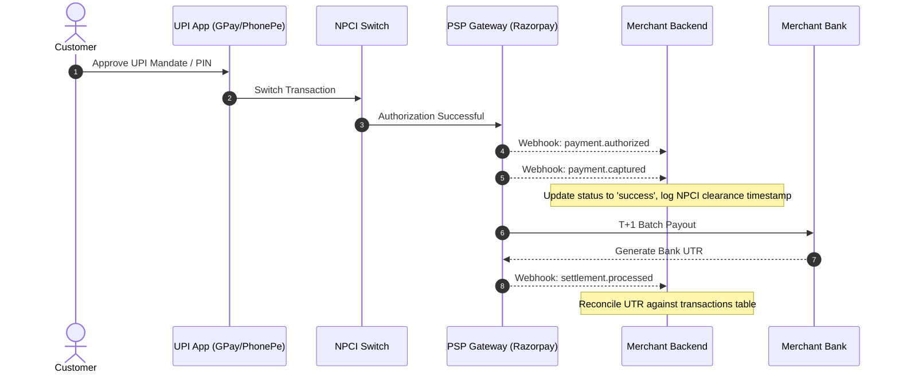

# Comprehensive Guide: UPI Payment App Integration & Settlement Analytics

A complete architectural and operational reference for building enterprise-grade UPI transaction analysis, automated reconciliation, and bank settlement tracking.

---

## 1. UPI Integration Approaches & Comparison

| Approach | Provider Examples | Settlement SLA | Key Capabilities | Best For |
|---|---|---|---|---|
| **Direct Aggregator API** | Razorpay, Cashfree, PayU | T+1 / T+2 (or Instant Payouts) | Webhooks for state changes (`payment.authorized`, `payment.captured`, `payment.failed`), settlement batches, fee visibility, chargeback APIs | Modern digital platforms, SaaS, E-commerce |
| **Bank-Grade High Throughput** | BillDesk, HDFC/ICICI Direct | T+1 / T+2 | High TPS handling, direct NPCI audit trails, dual-settlement reconciliation | High volume retail, utility billing, enterprises |
| **Direct App Business APIs** | Google Pay for Business, PhonePe Merchant, Paytm Business | T+1 / Instant to UPI | Direct QR/intent payouts, settlement report downloads, merchant dashboard webhooks | Offline merchants, hybrid retail |

---

## 2. Database Schema Architecture

The database model provides multi-stage transaction auditing from initiation to final bank deposit:

```sql
-- 1. Core Transactions Table
CREATE TABLE transactions (
  id VARCHAR(36) PRIMARY KEY,
  merchant_id VARCHAR(50) NOT NULL,
  customer_id VARCHAR(100),
  upi_id VARCHAR(255),
  amount DECIMAL(10,2) NOT NULL,
  currency VARCHAR(3) DEFAULT 'INR',
  
  -- Status Tracking
  status VARCHAR(20), -- 'initiated', 'pending', 'success', 'failed', 'refund'
  payment_app VARCHAR(50), -- 'google_pay', 'phonepe', 'paytm', 'whatsapp_pay', 'cred'
  psp_provider VARCHAR(50), -- 'razorpay', 'billdesk', 'payu'
  psp_reference_id VARCHAR(100) UNIQUE,
  
  -- Lifecycle Timestamps
  initiated_at TIMESTAMP,
  customer_authorized_at TIMESTAMP,
  cleared_by_npci_at TIMESTAMP,
  settled_at TIMESTAMP,
  
  -- Financial Breakdown
  gross_amount DECIMAL(10,2),
  psp_fee DECIMAL(10,2),
  payment_app_fee DECIMAL(10,2),
  gst_fee DECIMAL(10,2),
  net_amount_to_merchant DECIMAL(10,2),
  
  -- Dispute & Reversals
  is_disputed BOOLEAN DEFAULT FALSE,
  dispute_raised_at TIMESTAMP,
  chargeback_amount DECIMAL(10,2),
  reversal_reason VARCHAR(255),
  
  created_at TIMESTAMP DEFAULT CURRENT_TIMESTAMP,
  updated_at TIMESTAMP DEFAULT CURRENT_TIMESTAMP
);

-- 2. Settlement Batches (Aggregator -> Bank)
CREATE TABLE settlement_batches (
  id VARCHAR(36) PRIMARY KEY,
  merchant_id VARCHAR(50) NOT NULL,
  batch_date DATE NOT NULL,
  psp_provider VARCHAR(50) NOT NULL,
  
  total_transactions INT DEFAULT 0,
  total_gross DECIMAL(12,2),
  total_fees DECIMAL(10,2),
  total_net DECIMAL(12,2),
  
  -- Bank Settlement Proof
  utr VARCHAR(50) UNIQUE, -- Unique Transaction Reference from Bank
  bank_settlement_time TIMESTAMP,
  bank_balance_before DECIMAL(12,2),
  bank_balance_after DECIMAL(12,2),
  
  status VARCHAR(20), -- 'pending', 'partially_settled', 'settled'
  created_at TIMESTAMP DEFAULT CURRENT_TIMESTAMP
);

-- 3. Settlement Reconciliation Audit
CREATE TABLE settlement_reconciliation (
  id VARCHAR(36) PRIMARY KEY,
  transaction_id VARCHAR(36) REFERENCES transactions(id),
  settlement_batch_id VARCHAR(36) REFERENCES settlement_batches(id),
  
  status VARCHAR(20), -- 'matched', 'unmatched', 'mismatch'
  variance_amount DECIMAL(10,2) DEFAULT 0.0,
  notes TEXT,
  verified_at TIMESTAMP DEFAULT CURRENT_TIMESTAMP
);

-- 4. Fee Calculation Rules
CREATE TABLE fee_rules (
  id VARCHAR(36) PRIMARY KEY,
  psp_provider VARCHAR(50) NOT NULL,
  payment_app VARCHAR(50),
  amount_range_start DECIMAL(10,2),
  amount_range_end DECIMAL(10,2),
  psp_fee_percentage DECIMAL(5,3),
  psp_fee_fixed DECIMAL(10,2),
  payment_app_fee_percentage DECIMAL(5,3),
  payment_app_fee_fixed DECIMAL(10,2),
  effective_from DATE,
  effective_until DATE
);
```

---

## 3. Webhook Handling & Reliability Engineering



### Essential Reliability Best Practices:
1. **Idempotency**: Maintain a unique constraint on `psp_reference_id`. If a webhook arrives multiple times, update the entity without duplicate financial postings.
2. **Signature Validation**: Use HMAC SHA256 with the aggregator webhook secret before accepting incoming requests.
3. **Dead Letter Queue (DLQ)**: Queue unprocessable payloads for manual finance team review.
4. **Dispute Handling**: Track `dispute_raised_at` and withhold corresponding amounts from net settlement reporting until cleared.

---

## 4. End-to-End API Integration Reference

The project provides direct FastAPI endpoints to query and trigger transactions:
- `GET /api/analytics/transactions`: Filter transactions by status, date range, and merchant.
- `GET /api/settlements/summary`: Retrieve 7-day settlement batches with bank UTR numbers.
- `GET /api/settlements/reconciliation`: Audit match health and variance amounts.
- `GET /api/upi/kpis`: Real-time aggregated gross, net settled, success rates, and fee totals.
- `POST /api/upi/initiate`: Initiate a new UPI payment with fee calculation.
- `POST /webhooks/razorpay`: Capture real-time payment state transitions.
- `POST /webhooks/razorpay-settlement`: Capture settlement batch notifications with bank UTRs.
